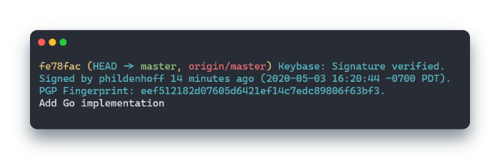

# harbour

Use Keybase to sign and verify your Git commits. Harbour has been tested on
Linux (using WSL), Windows, and macOS.



## Getting started

The instructions are much the same for Windows, Linux and macOS, just replace
the executable "harbour" with "harbour.exe" for Windows.

Store harbour in a safe place. Personally, I'm using
`/home/phil/.local/bin/harbour`.

Get the list of signing keys from Keybase. By default, you'll only have one.
Run `keybase pgp list` and find the PGP fingerprint that matches the key you
want to use and copy it. These are all the active PGP keys in your Keybase
account, so you can use any one.

``` sh
$ keybase pgp list
Keybase Key ID:  01012f7bbda55569ae53fdd476b788faffce02250790ba940a4cd5ba62a12de7c3ed0a
PGP Fingerprint: eef512182d07605d6421ef14c7edc89806f63bf3
PGP Identities:
   Phil Denhoff <phil@denhoff.ca>
```

In this case, I'll use `eef512182d07605d6421ef14c7edc89806f63bf3`.

Set the following in your `$HOME/.gitconfig`:

```git
[gpg]
    program = <FULL-PATH-TO-EXECUTABLE>
[commit]
    gpgsign = true
[user]
    signingkey = <YOUR KEY FROM KEYBASE>
```

Next time you sign a commit you'll automatically use your Keybase PGP key.
And the next time you verify commits (using `git log --show-signature`, for
example), Keybase will be used to verify the signatures.

## FAQ

### What? Why?

Well, there are lots of people online who show how you can export your PGP keys
from Keybase and import them into gnupg2, but that sorta defeats the purpose of storing your PGP keys in Keybase.

Harbour sits in-between Git and Keybase (without ever looking at your private
keys) and can still verify signatures from your existing GnuPG2 keychain.

### How do I keep using my GnuPG2 keys to verify signatures?

Set `HARBOUR_USE_GNUPG2` as an environment variable in your shell where you use
`git`. The value doesn't matter. Then, whenever Git wants to verify a
signature, Harbour will first try to verify with Keybase and, if a signature
can't be verified, will try again with GnuPG2. Signatures messages from
Keybase start with "Keybase: " and those from GnuPG start with "gpg: ".

#### One-time

```sh
HARBOUR_USE_GNUPG2=sure git log --show-signature
```

#### In your RC files

```bashrc
# $HOME/.bashrc
# or $HOME/.zshrc
# ... or anywhere else :)
export HARBOUR_USE_GNUPG2=please
```

### What are the downsides of using Keybase to sign my Git commits?

As far as I can tell, Keybase doesn't support storing subkeys, so you can't
make an offline master key and create regularly-expiring subkeys for signing
commits. By default, the expiration date for a PGP key on Keybase also seems
like it's 16 years which is a Pretty Long Time as far as keys go.

Day-to-day, you'll also notice a slow down in how long it take to show commit
messages with `git log --show-signature`. As far as I can tell, Keybase just
takes longer than GPG2 to verify a signature (roughly 1 second for Keybase
vs. 0.003 seconds for GnuPG2). Until Keybase changes that, we have to accept
slower signature load times in Git. Personally I consider it worth it but
your mileage may vary.
